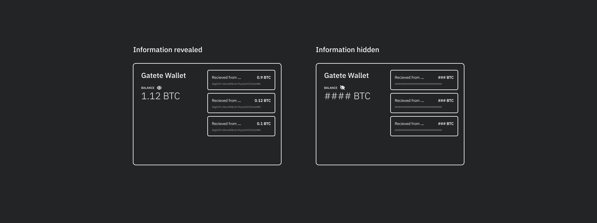
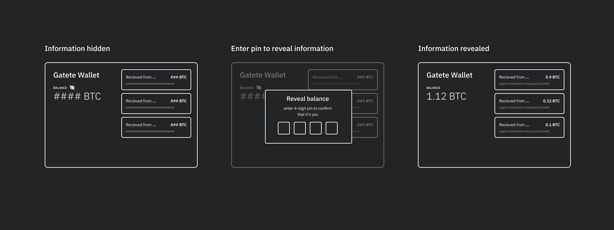
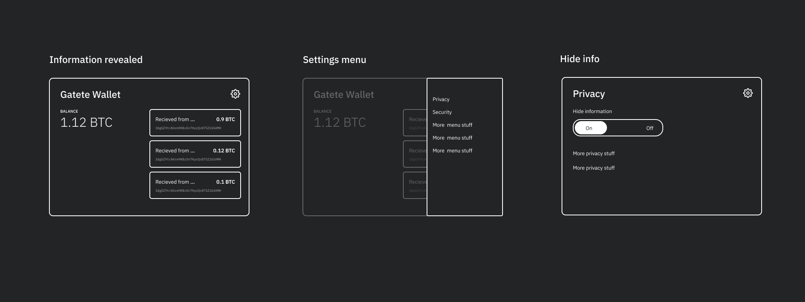
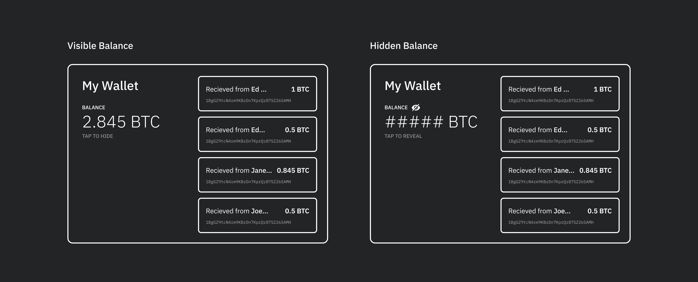
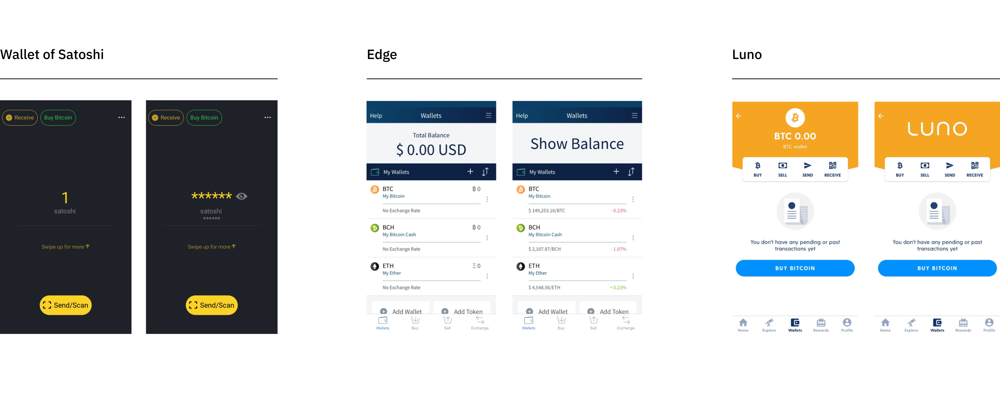
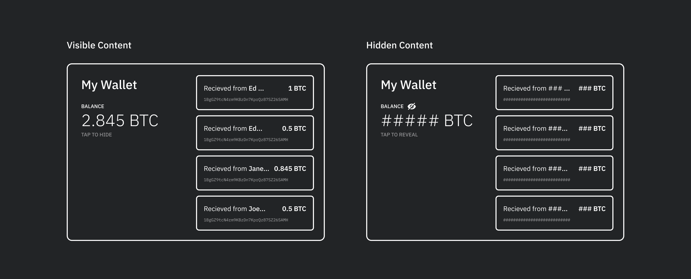

# Hiding Sensitive Information

Imagine this scenario. You are in a public place, and you need to make a payment using your bitcoin wallet. You open your wallet on your phone, but you don’t feel comfortable having your address and balance information clearly visible to strangers who may be looking over your shoulder. Hence by giving users the ability to hide sensitive information in their wallet if desired, they gain an added sense of privacy and security when using the app in public.

## What information is considered sensitive ?

Sensitive information in wallet applications include the wallet balance, addresses, private keys and previous transactions information. They are considered sensitive for the following reasons, the wallet balance is considered sensitive because it shows exactly how much you have in your wallet, addresses and previous transaction information are sensitive because they can be used to track how you spend and receive your bitcoins, and private keys, if they fall into the wrong hands, can be used to access and transfer your bitcoins.

It's quite common for wallets to protect private keys but not much is done for other sensitive information like the balance, addresses and previous transactions but a few wallets like Bitcoin Core, Wasabi, Wallet of Satoshi, and others have made it work though. Below are some solutions for hiding information;

## Solution 1: Hiding and revealing information with the hide icon

 The hide icon / button, which is usually displayed within close reach of the balance itself, is used to quickly and easily hide and reveal wallet information by tapping or clicking on it.

Pros

- It is quite convenient to switch between revealed and hidden state

Cons

- Super easy for anyone else to reveal your information if they have access to your device.

  

## Solution 2: Entering pin to unveil balance

A problem that seemed to arise throughout each  implementation was that is was as easy to reverse the hidden state as it was to create it. This may be for convenience sake, however, if you are in a situation where you are concerned about your wallets security, perhaps this feature should be locked unless a PIN or password has been entered. This could therefore reaffirm the identity of the wallet owner for extra security.

Pros

- The risk of an unauthorized person revealing your information is minimal due to the pin required

Cons

- It may be annoying having to repeatedly put in your min when ever you want to reveal your information especially if you do so often

  

## Solution 3: Information hidden by default

Another solution would be to invoke the wallet’s hidden state as a default when the app is opened. What this means is that in the event that someone sees your wallet when you open it, they wouldn't be able to make out the information. The pre-hidden state can be unveiled  after a tap, PIN entry, or perhaps a short 5 second timer.

Pros

- Users have some time to assess their environment before their info is displayed.

Cons

- The user may feel a bit frustrated having to wait for their information to be revealed especially in an urgent situation

## Solution 4: Removing the hide functionality from the homepage

A fourth solution would be to move the hide functionality away from the home screen and into the app settings. This way, if someone has access to your device and opens the app, they may not immediately know how to reveal the hidden information as it is not made obvious on the home screen as in the previous solutions.

Pros

- The risk of an unauthorized person revealing your information is minimal due to the fact that the toggle isn't immediately visible on the home screen

Cons

- This solution may not be convenient for a user to quickly hide their information if the need arises.

  

## Current Implementations of Hiding information

### Solution 1: Tapping on the Balance to Hide and Reveal It

In this method, the hide icon / button is usually displayed within close reach of the balance itself. Users can quickly and easily hide information by tapping on this button. This method, though quick and easy to use, only provides the user with a limited amount of privacy. All other addresses, transactions, and other information that you may want to keep private are still very much visible.

*This hidden balance feature is currently implemented by:*

#### Wallet of Satoshi

In this wallet, when the “Hide Balance” feature is selected, the balance on the home screen is hidden (in both BTC and $USD or other native currency), but the addresses and their transactional data are still visible.

#### Edge

In this wallet, there is no “Hide Balance” button or toggle, the user simply has to tap on their balance. After doing this, a large “show balance” is displayed on the screen to reverse the action.

#### Luno

In this wallet, there is also no use a “Hide Balance” button or toggle. Like Edge wallet, the user hides their balance by tapping it. The Luno logo is then displayed in its place.

Pros
- Quick for the user to hide and unveil their balance

Cons
- It doesn't do much for security if every other sensitive information is still displayed on the screen.
- Anyone other than the user can easily reveal the balance (given they have access to the users phone and wallet)

### Solution 2: Tapping on the Hide Icon Hides Balances, Addresses and Transactions

This method, implemented by Wasabi wallet, hides and veils sensitive information more thoroughly. Not only the balance is hidden but also the addresses and the transactions associated with the wallet. Wasabi also make this feature convenient for the user by hiding all sensitive information by clicking a single button as opposed to multiple.

#### Wasabi Wallet

In this wallet, when the hide balance icon (eye) is selected, the balance on the home screen is hidden as well as your bitcoin address.

Pros
- Gives the user an added level of security and a sense of comfort when all sensitive information is hidden (balances, addresses, and transactions are hidden.
  Cons

- Again, the hidden information can easily be revealed.

  

## Why is this pattern important to designers?

Privacy in bitcoin payments goes far beyond hiding balances and other sensitive information, the privacy by design framework states that privacy should be incorporated and built into products by default. This way, whether or not the user is concerned with their data privacy, they would always be protected through good UX.

By including the hiding information pattern in design of wallets, we give users a greater sense of control and comfortability in any environment when using it. They have the freedom to decide whether or not they want their information visible.

[^1]: https://medium.com/@olanrewajusodiq64/the-ui-ux-of-hide-balance-designing-to-improve-asset-security-e4b20668f315
[^2]: https://www.invisionapp.com/inside-design/designing-for-privacy/
[^3]: https://uxdesign.cc/how-to-design-with-privacy-in-mind-24c96cfc2611
[^4]:  https://github.com/bitcoin-core/gui/issues/82

[5]: https://docs.wasabiwallet.io/using-wasabi/PrivacyMode.html

